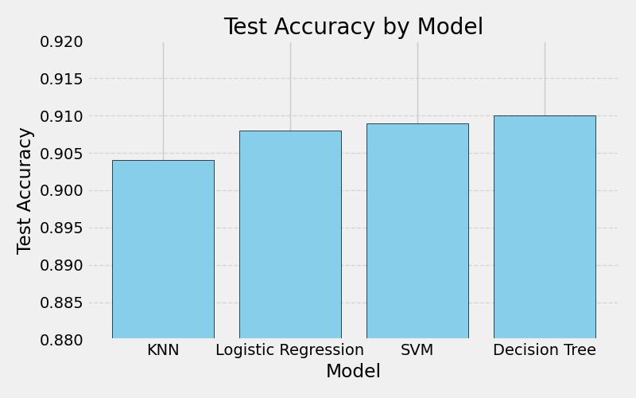
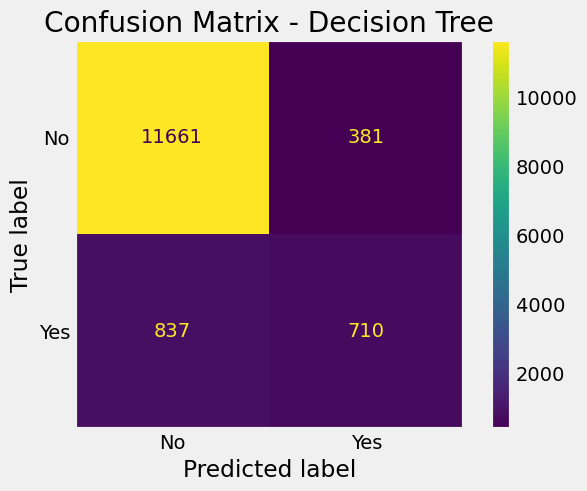
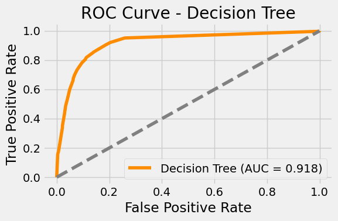

# Comparing Classifiers on the Bank Marketing Dataset

This project evaluates and compares the performance of multiple classification algorithms—**Logistic Regression**, **K-Nearest Neighbors**, **Decision Trees**, and **Support Vector Machines**—using the UCI Bank Marketing dataset.

## 📊 Business Problem

A Portuguese banking institution conducted telemarketing campaigns to promote term deposit subscriptions. The goal is to predict whether a client will subscribe to a term deposit (`y = yes/no`) based on socio-economic and campaign-related data.

## 🛠️ Models Compared

- Logistic Regression
- K-Nearest Neighbors (KNN)
- Decision Tree Classifier
- Support Vector Machine (SVM)

## 🔍 Evaluation Metrics

- **Confusion Matrix**
- **Classification Report**
- **ROC AUC Score**
- **Accuracy, Precision, Recall, F1-Score**
- **Train/Test Split (70/30)**

## 🧪 Methodology

1. Data Cleaning & Preprocessing using Pipelines
2. Feature Scaling and One-Hot Encoding
3. Hyperparameter Tuning via GridSearchCV
4. Train/Test Evaluation and Cross-Validation
5. Performance Visualization and Recommendations

## 📈 Model Comparison

We evaluated all models using accuracy and training time. The table below summarizes results:

| Model               | Train Time (s) | Train Accuracy | Test Accuracy |
|---------------------|----------------|----------------|----------------|
| KNN                 | 0.719          | 0.927          | 0.904          |
| Logistic Regression | 0.164          | 0.910          | 0.908          |
| SVM                 | 40.651         | 0.923          | 0.909          |
| Decision Tree       | 0.130          | 0.918          | **0.910**      |

### 📊 Test Accuracy by Model

## 🧠 Findings

- **Decision Tree** had the highest test accuracy (91%) after tuning.
- **Logistic Regression** performed nearly as well, with the fastest training time.
- **SVM** offered competitive accuracy but with significantly longer training time.
- All models benefited from hyperparameter tuning and cross-validation.

### ROC Curve and Confusion Matrix for Best Model

Visualizations for the **Decision Tree Classifier** are included in the notebook:
- **Confusion Matrix** showing class-level prediction performance
- **ROC Curve** with AUC around 0.91

## ✅ Recommendations

- **Deploy the tuned Decision Tree** for production if model interpretability and speed are priorities.
- **Logistic Regression** is an excellent alternative for fast, balanced performance.
- **Further Improvements**:
  - Experiment with ensemble methods (e.g., Random Forest, XGBoost)
  - Handle class imbalance using SMOTE or cost-sensitive learning
  - Include domain-specific feature engineering and threshold tuning

## 📁 Files Included

- `Comparing_Classifiers_Project.ipynb`: Final notebook with all problem steps and analysis
- `test_accuracy_chart_updated.png`: Bar chart comparing model performance
- `README.md`: Project summary and visual documentation

## 📎 Data Source

UCI Machine Learning Repository: [Bank Marketing Dataset](https://archive.ics.uci.edu/ml/datasets/bank+marketing)

---

*This repository is part of a practical machine learning assignment focused on model comparison, tuning, and responsible evaluation.*
